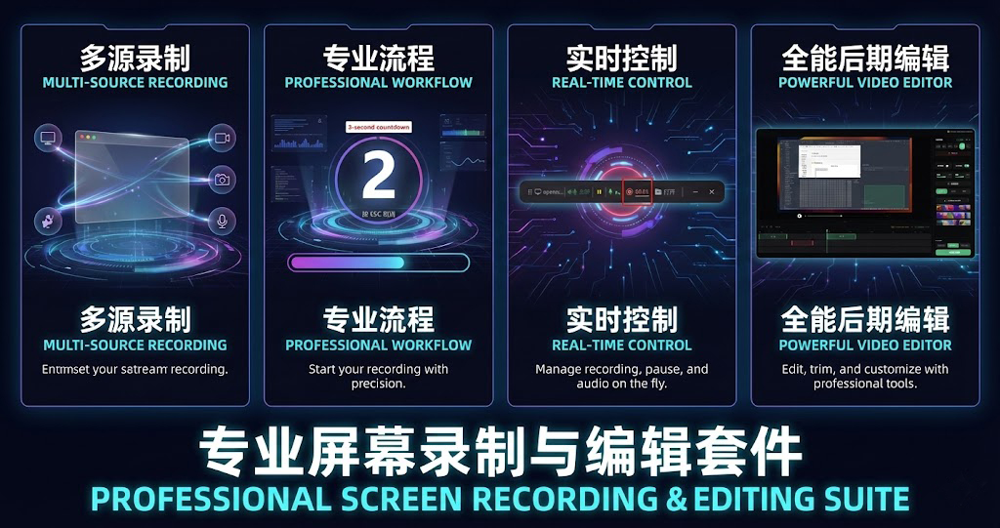
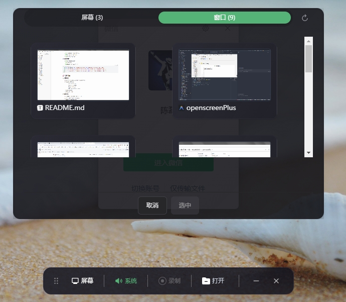
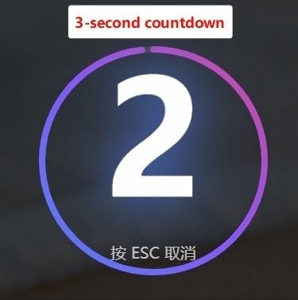
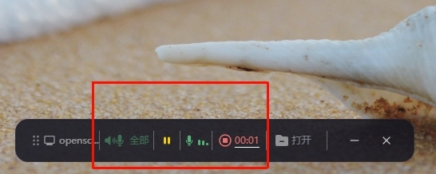
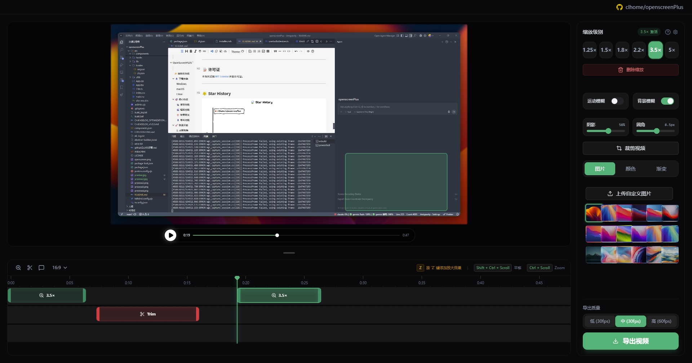
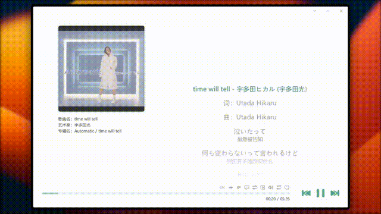

<p align="center">
  
</p>

# <p align="center">`OpenScreenPLUS`</p>

<p align="center"><strong>Free and open-source screen recording and video editing tool, an open-source alternative to Screen Studio</strong></p>

<p align="center">
  [<a href="./README中文.md">中文</a>] | [<a href="./README.md">English</a>]
</p>

<p align="center">
  🌟 This project is a secondary development based on <a href="https://github.com/siddharthvaddem/openscreen">siddharthvaddem/openscreen</a> and <a href="https://github.com/yzz05220-rgb/openscreen-chinese">yzz05220-rgb/openscreen-chinese</a>.
</p>

<p align="center">
  <a href="https://github.com/clhome/openscreenPlus/releases">
    
  </a>
  <a href="https://github.com/clhome/openscreenPlus/blob/main/LICENSE">
    
  </a>
  <a href="https://github.com/clhome/openscreenPlus/stargazers">
    
  </a>
</p>

---




## ✨ Internationalization

Automatically matches Chinese or English based on the system language.

---

## 📥 Download & Install

Download the latest installer from the [Releases](https://github.com/yzz05220-rgb/openscreen-chinese/releases) page.

### Windows

Download `OpenScreenPlus-x.x.x-Setup.exe` and double-click to install.

### macOS

Download the `.dmg` file and drag it to your Applications folder.

### Linux

Download the `.AppImage` file, add execution permissions, and run it.

---

## 🎯 Core Features

### 📹 Recording

- ✅ Record the entire screen or specific application windows
- ✅ Multiple audio recording modes (Mute / System / Mic / All)
- ✅ Auto-detect audio devices
- ✅ Pause at any time during recording
- ✅ 3-second countdown before recording

### 🎬 Editing

- ✅ Add manual zoom (customizable zoom depth)
- ✅ Customize zoom duration and position
- ✅ Crop video recordings to hide content
- ✅ Trim video segments

### 🎨 Visual Effects

- ✅ Choose wallpapers, solid colors, gradients, or custom images for backgrounds
- ✅ Motion blur effects for smoother panning and zooming
- ✅ Add annotations (Text, Arrows, Images)
- ✅ Customize corners, shadows, and margins

### 📤 Exporting

- ✅ Export in different aspect ratios and resolutions
- ✅ Multiple quality options
- ✅ Browser rendering or FFmpeg fast export

<p align="center">
  
  
</p>
<p align="center">
  
  
</p>

---


## 🚀 Quick Start

### 1. Record Video

1. Launch the app and click "Screen" to select the recording source (Entire Screen or Specific Window).
2. Click "All" to select the audio mode:
   - **Mute**: Do not record any audio
   - **System**: Record system sound only
   - **Mic**: Record microphone only
   - **All**: Record both system sound and microphone
3. Click "Record" to start recording.
4. Click "Stop" when finished.

### 2. Edit Video

1. In the editor, use the timeline to add zooms, crops, or annotations.
2. Use AI smart zoom to automatically generate zoom suggestions.
3. Adjust backgrounds, motion blur, and other visual effects.
4. Preview the results.

### 3. Export Video

1. Click the "Export" button.
2. Select export quality and method.
3. Wait for the export to complete.
   - Defaults to 2x playback speed for export; higher speeds may cause frame drops.

---

## 🛠️ Build from Source

```bash
# Clone the repository
git clone https://github.com/clhome/openscreenPlus.git
cd openscreenPlus

# Install dependencies
npm install
# If installation fails, set the registry mirror
npm config set registry https://registry.npmmirror.com

# Run in development mode
npm run dev

# Build for Windows
npm run build:win

# Build for macOS
npm run build:mac

# Build for Linux
npm run build:linux

# Modify export speed (defaults to 2.0)
# File: openscreenPlus\src\lib\exporter\videoExporter.ts
# video.playbackRate = 2.0;
```

---

## 🔧 Platform Specific Notes

### macOS

If macOS Gatekeeper blocks the app (due to lack of developer certificate), run this command in terminal:

```bash
xattr -rd com.apple.quarantine /Applications/Openscreen.app
```

Then go to **System Preferences > Security & Privacy** and grant "Screen Recording" and "Accessibility" permissions.

### Linux

Download the `.AppImage` file from Releases, then:

```bash
chmod +x Openscreen-Linux-*.AppImage
./Openscreen-Linux-*.AppImage
```

Depending on your desktop environment, you may need to grant screen recording permissions.

### Windows

On first run, Windows Defender may prompt "Windows protected your PC". Click "More info" and then "Run anyway".

---

## 🏗️ Tech Stack

- **Framework**: Electron + React + TypeScript
- **Build Tool**: Vite
- **Graphics Rendering**: PixiJS
- **Timeline**: dnd-timeline
- **Internationalization**: i18next

---

## 🙏 Acknowledgements

This project is based on [OpenScreen](https://github.com/siddharthvaddem/openscreen) and [openscreen-chinese](https://github.com/yzz05220-rgb/openscreen-chinese). Thanks to the original authors [@siddharthvaddem](https://github.com/siddharthvaddem) and [yzz05220-rgb](https://github.com/yzz05220-rgb) for their open-source contributions!

---

## 📝 License

This project is licensed under the [MIT License](./LICENSE).

---

## 🌟 Star History


[](https://www.star-history.com/#clhome/openscreenPlus&type=date&legend=top-left)
